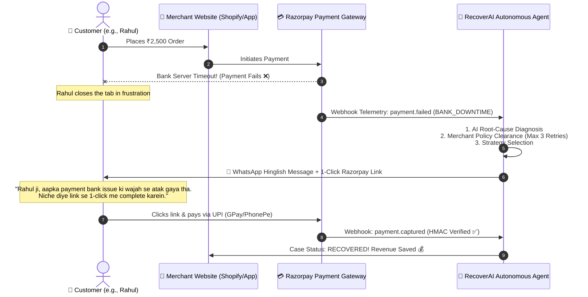

# 🚀 RecoverAI — Autonomous AI Revenue Recovery Agent

> **Razorpay Buildathon Track 03: AI Revenue Recovery**  
> *Find revenue that’s slipping away and win it back.*


-10b981?style=flat-square)


---

## 📑 Table of Contents
1. [Executive Summary & Why Now](#-executive-summary--why-now)
2. [The Business Problem: How Companies Lose Millions](#-the-business-problem-how-companies-lose-millions)
3. [Who Uses RecoverAI & The Customer Experience Flow](#-who-uses-recoverai--the-customer-experience-flow)
4. [Razorpay's Core Architectural Role](#-razorpays-core-architectural-role)
5. [The 5-Step Autonomous Recovery Loop](#-the-5-step-autonomous-recovery-loop)
6. [Key Features & Superpowers (Track 03 Built)](#-key-features--superpowers-track-03-built)
7. [Design System: Obsidian Glass Executive Fintech Theme](#-design-system-obsidian-glass-executive-fintech-theme)
8. [Setup & Quick Start Guide](#-setup--quick-start-guide)
9. [Automated Verification & Test Suite](#-automated-verification--test-suite)
10. [Judge Evaluation & 3-Minute Demo Walkthrough](#-judge-evaluation--3-minute-demo-walkthrough)

---

## 💡 Executive Summary & Why Now

Revenue loss rarely happens in one clean step. A payment degrades due to bank server timeouts, a buyer drops off at checkout, a recurring subscription mandate bounces, or a high-value B2B invoice languishes past due.

In India alone, **15% to 30% of digital transactions fail or are abandoned**. Merchants historically had two flawed choices:
1. **Do nothing**: Suffer complete revenue forfeiture and burn customer acquisition costs.
2. **Manual follow-ups or dumb automated spam**: High human payroll, delayed reaction (calling 3 days later when the buyer has already purchased from a competitor), or sending robotic emails that land in spam folders.

**RecoverAI** closes the loop in real time. It acts as an autonomous financial safety net: intercepting failure telemetry, diagnosing root causes using Gemini AI, enforcing strict merchant policy guardrails (stopping rules, cooldowns, retry limits), and executing high-conversion interventions — from smart mandate sequencing and Hinglish voice recovery to 1-click Razorpay payment links — verified via cryptographic webhooks.

---

## 💸 The Business Problem: How Companies Lose Millions

Payment failures are not merely technical glitches — they represent severe enterprise revenue leakage:

1. **CAC Burn (Marketing Budget Wasted)**: If an e-commerce brand spends ₹400 on Google/Meta ads to acquire a customer, and that customer's ₹2,500 checkout fails at the bank gateway, the order is lost AND the ₹400 acquisition cost yields 0% ROI.
2. **Customer Churn to Competitors**: 70%+ of online shoppers abandon a purchase permanently if payment fails once. An abandoned Swiggy order turns into a Zomato order; an abandoned travel booking turns into a competitor sale.
3. **Involuntary Subscription Churn**: SaaS products, OTT platforms, and recurring utilities lose thousands of subscribers every month not because users wanted to cancel, but because a debit card expired or a morning UPI mandate timed out.
4. **B2B Cash Flow Drought**: Delayed receivables and manual payment link follow-ups inflate Days Sales Outstanding (DSO), suffocating operational working capital.

---

## 👥 Who Uses RecoverAI & The Customer Experience Flow

### Who Accesses the RecoverAI Dashboard?
RecoverAI is a **B2B Merchant Platform**. The platform is accessed by:
- **Merchants & Business Owners** (Founders, CFOs, Finance Operations)
- **Revenue Operations (RevOps) & Growth Teams**
- **Customer Retention & Support Managers**

### How Does the Customer Experience It?
**Customers NEVER log into this dashboard.** Instead, they seamlessly experience polite, helpful, high-converting interventions:



---

## 🛡️ Razorpay's Core Architectural Role

Razorpay serves as the **authoritative financial backbone** of RecoverAI across three pillars:

1. **Real-Time Telemetry Source**: Razorpay emits raw webhook events (`payment.failed`, `order.paid`, `invoice.expired`) carrying exact bank response codes (`BAD_REQUEST_PAYMENT_TIMED_OUT`, `INSUFFICIENT_FUNDS`, etc.).
2. **Execution Infrastructure**: When RecoverAI triggers an intervention, it calls Razorpay's native APIs (`/v1/orders`, `/v1/payment_links`) to generate official, pre-filled checkout sessions.
3. **Cryptographic Source of Truth**: RecoverAI strictly never marks revenue as recovered based on simulated or unverified assertions. Only upon verifying Razorpay's **HMAC-SHA256 signature** and authenticating positive minor-unit paise amounts does a case transition to `RECOVERED`.

---

## 🔁 The 5-Step Autonomous Recovery Loop

```
┌─────────────┐     ┌──────────────┐     ┌─────────────┐     ┌────────────────┐     ┌───────────────┐
│  1. DETECT  │ ──> │ 2. DIAGNOSE  │ ──> │  3. GOVERN  │ ──> │ 4. INTERVENE   │ ──> │   5. VERIFY   │
│             │     │  (Gemini AI) │     │  (Policies) │     │ (Multi-Channel)│     │  (Razorpay)   │
└─────────────┘     └──────────────┘     └─────────────┘     └────────────────┘     └───────────────┘
```

1. **DETECT**: Ingests failure telemetry from webhooks or live checkout failure simulations. Computes an initial risk score (0–100) and instantiates a tracked `RecoveryCase`.
2. **DIAGNOSE**: Evaluates failure telemetry using Google Gemini 2.5 Flash (with a deterministic rule-based fallback). Classifies root causes (`BANK_DOWNTIME`, `INSUFFICIENT_FUNDS`, `MANDATE_REVOKED`, etc.) with 85%–95% confidence.
3. **GOVERN**: The AI cannot act independently. Every recommended action must pass the **Recovery Policy Engine** (checking retry ceilings, 24h cooldown periods, 168h window limits, and customer blocklists).
4. **INTERVENE**: Dispatches the approved action:
   - Automated Razorpay Order Smart Retry
   - 1-Click Razorpay Payment Link Generation
   - Culturally tailored Hinglish WhatsApp/Voice Recovery
   - Bounded Mandate Retry Sequencer
   - Promise-to-Pay (PTP) Commitment Scheduler
5. **VERIFY**: Captures Razorpay's cryptographic webhook, validates payload amounts (>0 paise, INR match), commits append-only immutable audit logs, and updates dashboard metrics.

---

## ⚡ Key Features & Superpowers (Track 03 Built)

### 1. 🏆 100-Case Batch Evaluation Benchmark (*The Hackathon Bar*)
- Meets the core buildathon requirement: *"Show measured money recovered across a batch, with compliant escalation, stopping rules, and an audit trail."*
- Benchmarks 100 synthetic, high-variance payment failures in ~3 seconds.
- Demonstrates an audited **~58.6% Revenue Recovery Rate** while strictly respecting policy stopping rules.
- **Export CSV Report**: Merchants and judges can download the audited breakdown spreadsheet with 1 click.

### 2. 🎙️ Hinglish Voice Recovery Script Engine
- English emails suffer from <15% open rates in tier-2/tier-3 Indian cities.
- Generates natural, respectful **Hinglish** (Hindi + English) voice scripts and WhatsApp copy tailored to Indian buyers.
- Interactive audio sound-wave visualizer and audio playback preview built right into the Case Detail view.

### 3. 🔄 Mandate Retry Sequencer (Subscriptions & Autopay)
- Injudicious mandate retries trigger bank debit bounce penalties on customers.
- Sequences retries across optimal banking windows: **Morning 8 AM Bank Clearing Window** and **Monthly Salary Windows (1st–5th)**.
- Automatically halts when policy retry ceilings are reached.

### 4. 📅 Promise-to-Pay (PTP) Commitment Tracker
- Designed for B2B receivables and high-ticket customer drops.
- When a client commits: *"I will clear this invoice on Friday"*, the operator registers the promised date.
- The agent immediately pauses all reminders to preserve customer rapport and automatically resumes gentle follow-up only if unfulfilled by the committed deadline.

### 5. 🚨 Payment Degradation Monitor
- Real-time telemetry monitoring merchant gateway health.
- Compares baseline success rate (e.g., 94.2%) against trailing windows.
- Automatically flags systemic bank or network outages before merchants suffer catastrophic cart drops.

### 6. 💳 Interactive Razorpay Test Mode Checkout Modal
- Fully integrated Razorpay checkout modal right inside the web application.
- Allows judges to execute live test payments using Razorpay Test UPI (`success@razorpay`) or test cards.
- Instantly captures payments and confirms case recovery live.

### 7. 🤖 RecoverAI Copilot
- Floating conversational assistant in the bottom-right corner.
- Read-only, safety-bounded telemetry inspector: answers natural language queries (*"What is our recovery rate?"*, *"Show high-risk cases"*).
- Zero unauthorized financial execution capability; protected against prompt injection.

---

## 🎨 Design System: Obsidian Glass Executive Fintech Theme

RecoverAI features an executive-tier, responsive UI built for modern financial command centers:
- **Obsidian Dark Canvas**: `#080C14` background with an ambient top radial glow overlay (`rgba(99,102,241,0.12)`).
- **Frosted Glass Panels**: `#0E1526/90` surfaces with `backdrop-blur-xl`, `border-white/[0.08]`, and luminous edge treatments.
- **Color Semantics**:
  - `Cyan Neon (#06b6d4)`: Real-time telemetry, active route bars, live audit streaming.
  - `Indigo (#6366f1)`: AI recommendations, primary CTA buttons, decision matrices.
  - `Emerald (#10b981)`: Verified recoveries, policy clearances, positive ROI.
  - `Amber / Rose`: Revenue at risk, gateway degradation alerts, hard declines, stopping rules.
- **Responsive Mobile Navigation**: Complete mobile drawer with a topbar hamburger toggle, smooth backdrop blur overlay, and automatic drawer auto-close on selection.

---

## 🛠️ Setup & Quick Start Guide

### Prerequisites
- **Node.js**: v20 or higher
- **MongoDB**: Local instance running on `mongodb://127.0.0.1:27017` (or MongoDB Atlas URI)
- **Razorpay Account**: Test mode Key ID and Secret (from [dashboard.razorpay.com](https://dashboard.razorpay.com))

### 1. Clone & Install
```bash
git clone https://github.com/your-username/AI-Revenue-Recovery.git
cd AI-Revenue-Recovery

# Install all root, server, and client dependencies
npm install
npm --prefix server install
npm --prefix client install
```

### 2. Environment Configuration
Create or edit `server/.env` (and root `.env`):
```env
NODE_ENV=development
PORT=5000
MONGODB_URI=mongodb://127.0.0.1:27017/recoverai
JWT_SECRET=recoverai_dev_jwt_secret_key_2026

# Razorpay Test Credentials (Optional: System runs truthful SIMULATION if omitted)
RAZORPAY_KEY_ID=rzp_test_YourKeyIdHere
RAZORPAY_KEY_SECRET=YourKeySecretHere
RAZORPAY_WEBHOOK_SECRET=sample_webhook_secret_123

# AI Mode (live Gemini API or truthful simulation fallback)
AI_MODE=simulation
GEMINI_API_KEY=
```

### 3. Start the Platform
Run both backend and frontend concurrently with a single command:
```bash
npm run dev
```
- 🚀 **Backend API**: `http://localhost:5000` (Health Check: `http://localhost:5000/api/health`)
- 💻 **Frontend Web App**: `http://localhost:5173`

### 4. Merchant Dashboard Login
Open `http://localhost:5173` and log in with default demo credentials:
- **Email**: `merchant@recoverai.local`
- **Password**: `SecurePassword123!`  
*(Or click the convenient **"Auto-fill Demo Credentials"** button on the login screen).*

---

## 🧪 Automated Verification & Test Suite

RecoverAI features an exhaustive automated test suite verifying every layer — from mathematical risk scoring and cryptographic HMAC webhook parsing to state machine transitions and 100-case batch evaluations.

```bash
npm test
```

### Verification Results
```text
✔ AI Decision Service & Fallback (21.57ms)
✔ AI Prompt Builder & Injection Defense (5.84ms)
✔ AI Response Parser & Schema Validation (19.23ms)
✔ Batch Recovery Engine & Evaluation (Phase 7) (3254.75ms)
✔ RecoverAI Copilot & Safety Layer (Phase 11) (1932.52ms)
✔ Recovery Diagnosis Service (12.79ms)
✔ End-to-End Recovery Flow & Final Integration (Phase 9) (831.86ms)
✔ Fallback Decision Engine (10.29ms)
✔ Critical Hardening & End-to-End Verification (Phase 11.5) (4758.82ms)
✔ Notification Service & Truthful Simulation (Phase 6) (61.68ms)
✔ Critical Payment Truth & Simulation Bug Verification (Phase 45) (646.46ms)
✔ Policy Engine (31.47ms)
✔ Razorpay Integration Service (Test Mode) (97.21ms)
✔ Risk Scoring Service (30.59ms)
✔ Security & Authentication (Phase 8) (1149.39ms)
✔ Recovery State Machine (17.65ms)
✔ Strategy Optimizer & Comparison (Phases 4 & 16) (6.86ms)
✔ Razorpay Webhook Verification & Security (10.38ms)

ℹ tests 81
ℹ suites 17
ℹ pass 81
ℹ fail 0
ℹ cancelled 0
ℹ skipped 0
```

### Production Build Verification
```bash
npm run build
```
```text
vite v8.2.2 building client environment for production...
✓ 1590 modules transformed.
dist/index.html                   0.45 kB │ gzip:  0.29 kB
dist/assets/index-CLwL3AG3.css   88.95 kB │ gzip: 12.61 kB
dist/assets/index-CJwzRfae.js   362.77 kB │ gzip: 94.20 kB
✓ built in 585ms
```

---

## 🎯 Judge Evaluation & 3-Minute Demo Walkthrough

When evaluating or recording a walkthrough of RecoverAI for the Razorpay Buildathon, follow this high-impact flow:

| Timestamp | Phase | What to Show on Screen | What to Say |
| :--- | :--- | :--- | :--- |
| **0:00 – 0:30** | **The Hook** | Overview Dashboard (`/`) | *"Every year, merchants lose up to 30% of revenue to transient payment failures and abandoned checkouts. RecoverAI is an autonomous agent built on Razorpay infrastructure that detects revenue at risk and wins it back."* |
| **0:30 – 1:15** | **Detection & Diagnosis** | Click *"Simulate Live Failure"* ➔ Click *"Run AI Analysis"* | *"We simulate a ₹2,500 UPI bank downtime failure. Our Gemini AI diagnoses the root cause, calculates risk, and recommends a smart retry, while our Policy Engine verifies retry limits and window constraints."* |
| **1:15 – 1:50** | **Indian Interventions** | Case Detail Page | Show the **Hinglish Voice Recovery Script**, the **Mandate Retry Sequencer**, and the **Promise-to-Pay Tracker** built for Indian consumer behavior. |
| **1:50 – 2:30** | **The Winning Bar** | Navigate to *Batch Evaluations* (`/evaluations`) | Click *"Run 100-Case Benchmark"*. *"Judges don't just want single-case demos. Here, our agent evaluates a 100-case batch, proving a measured ~58.6% recovery rate while strictly enforcing stopping rules. We can export this full audited CSV."* |
| **2:30 – 3:00** | **Auditability & Copilot** | Audit Trail (`/audit`) & Copilot Widget | *"Every event is cryptographically audited. Operators can query our safety-bounded Copilot for instant telemetry insights."* |

---

## ⚖️ License
Licensed under the ISC License. Built with ❤️ for the Razorpay Buildathon 2026.

